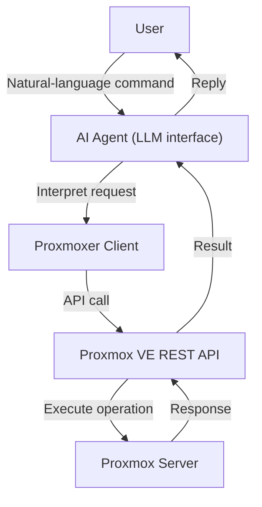

# Architecture Diagram

```mermaid
graph TD
    User["User"]
    Agent["AI Agent (LLM interface)"]
    Proxmoxer["Proxmoxer Client"]
    ProxmoxAPI["Proxmox VE REST API"]
    ProxmoxServer["Proxmox Server"]

    User -->|Natural-language command| Agent
    Agent -->|Interpret request| Proxmoxer
    Proxmoxer -->|API call| ProxmoxAPI
    ProxmoxAPI -->|Execute operation| ProxmoxServer
    ProxmoxServer -->|Response| ProxmoxAPI
    ProxmoxAPI -->|Result| Agent
    Agent -->|Reply| User
```
